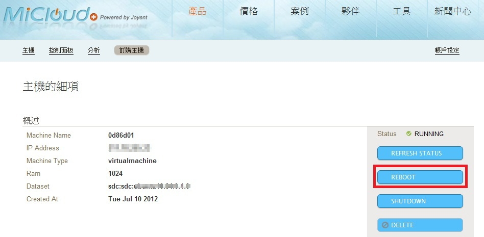
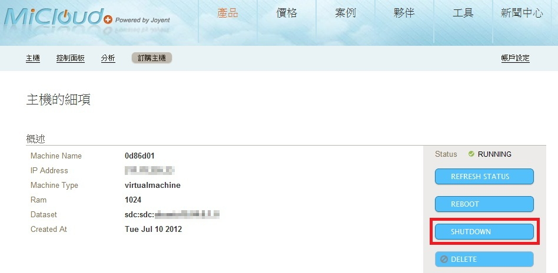
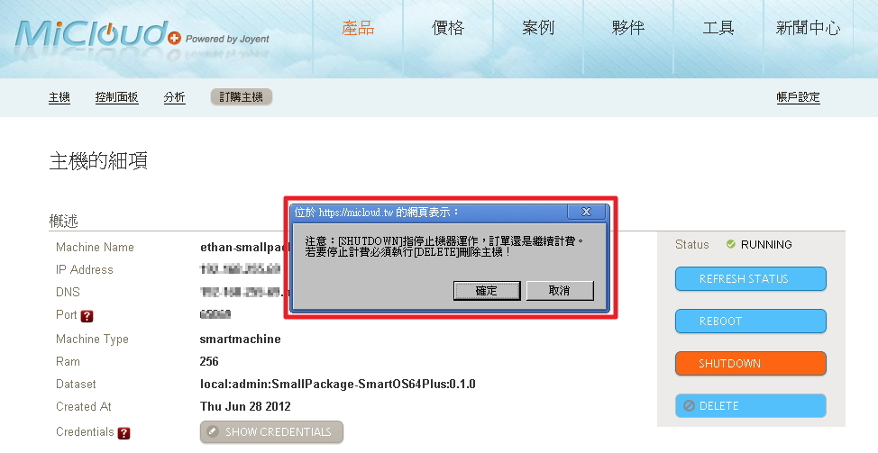
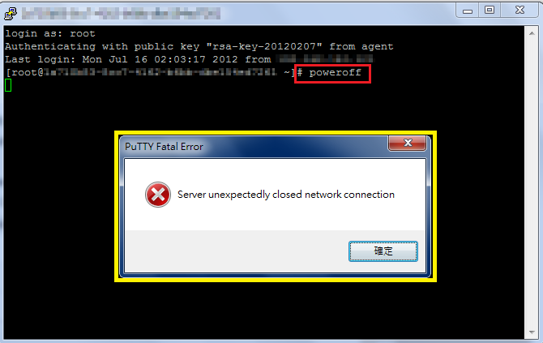
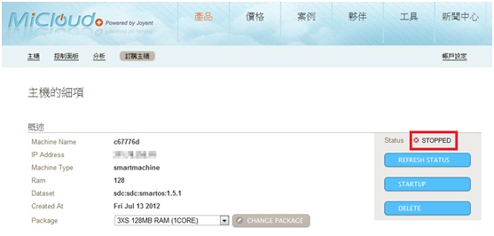
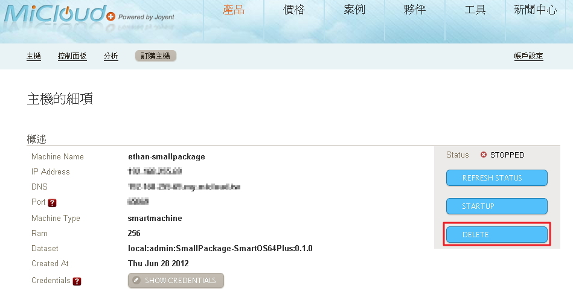

主機之重啟、關閉與刪除
===
MiCloud自助服務平台提供給您直接操控主機之重啟、關閉及刪除功能，在您登入MiCloud Customer Portal之後，您可以至主機頁面，點選您欲操控的主機，在右方控制面板中點選您所需要的服務。相關說明如下:


主機之重啟
===
在您登入MiCloud Customer Portal之後，您可以至主機頁面，點選您欲操控的主機，在右方控制面板中，點選"REBOOT"進行重啟。如下圖:





Reboot會經過關閉後再啟動主機，請用戶耐心等候。


----
主機之關閉
===
關閉主機可由MiCloud管理平台上點選shutdown按鈕，也可以使用指令進行關閉，相關說明如下:


1.由MiCloud管理平台上進行


同上主機管理頁面，點選"shutdown"進行關閉主機。如下圖:



※shut down後不代表終止合約，帳單仍會繼續計費，如要停止計費請執行DELETE刪除主機。如下圖提醒:





2.執行指令進行關閉
登入主機後使用指令來執行shutdown，指令如下:

```
#poweroff
```

以SmartMachine為例，執行畫面如下:


執行poweroff後會跳出下方黃色框框的警告視窗，提醒您主機已中斷連線。



再回到MiCloud平台上檢查主機是否已被關閉。



----
主機之刪除
===
同上主機管理頁面，點選"DELETE"按鍵後，系統將會移除您的主機。


※刪除主機前必需先Shut down主機後才能刪除。





刪除後主機及其上相關資料將無法回復，請確認後再執行。


