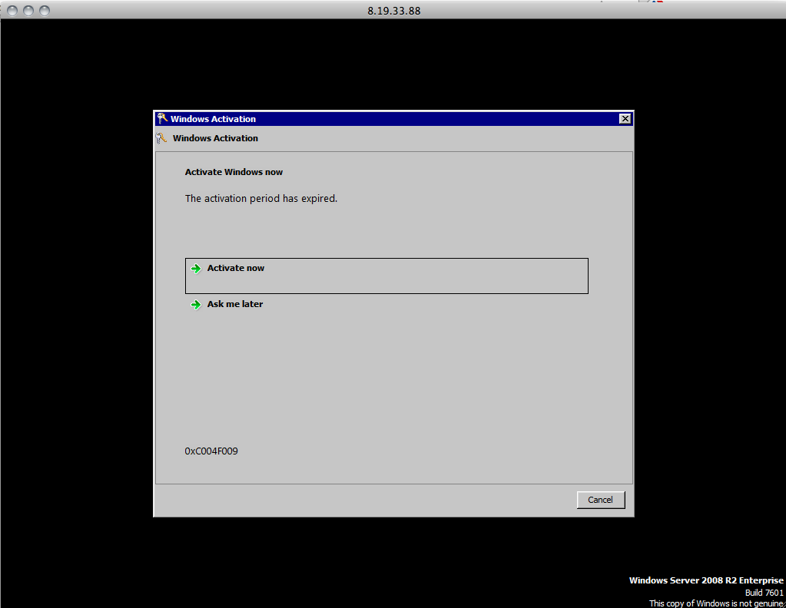
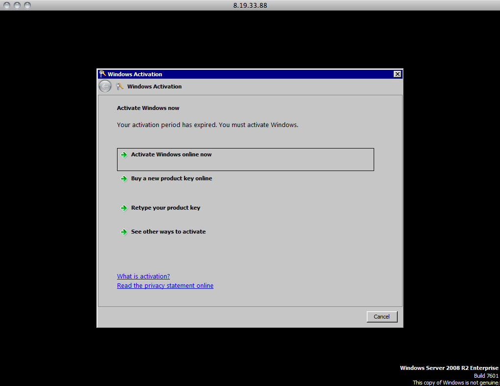
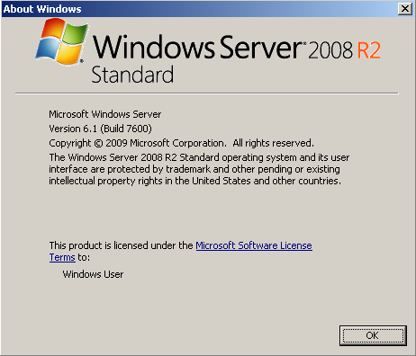

Frequently Asked Questions:

Do I need to activate the Windows license?

No. Activation should happen automatically, but it is not immediate and may take some time. To activate manually right click on My Computer and then click on Activate windows now. Do not try to activate the licence in any other way.
Where is my second harddrive?

The second disk in the Windows instances are not initialized. You have to use the Server Management utility to initialize the new drive and create and format a new NTFS or FAT32 partition. Please see the Windows Drive Initialization Walkthrough.zip for screenshots on this process.
What is my hostname?

*  Click Start > Run
*  In the pop-up box type cmd and press Enter.
*  You should now have a black command prompt running. Type 'hostname' and press Enter.

You will see the host name. The initial host name is generated by Windows and will for all intents and purposes be random. You can change your hostname by using the Server Management utility.

What is my IP address?

*  Click Start > Run
*  In the pop-up box type cmd and press Enter.
*  You should now have a black command prompt running. Type ipconfig and press Enter.

You will get a list of all the network interfaces and their IP addresses.

How do I add another Windows instance?

To add another Windows server, go to http://my.joyentcloud.com.
How do I activate my Windows server?

Your Windows server is activated on provisioning.

However, some times you may have to Activate Windows when you first log in.

You will see this box. Click the 'Activate Now' button.

Then you want to click the 'Activate Windows online now' Button.

It may take a few minuets for the Microsoft Activation servers to finish the Activation process:

Once your Windows system is activated you will see this confirmation:

If for some reason you get an activation error send an email to support@joyent.com
__What Windows version am I running?__

*  Click __Start > Run__
*  In the pop-up box type cmd and press Enter.
*  You should now have a black command prompt running. Type winver and hit Enter.

You will see a popup box that will tell you about your version of Windows, similar to the one below:

----
資料來源：[Joyent Wiki](http://wiki.joyent.com/display/www/Documentation+Home)
